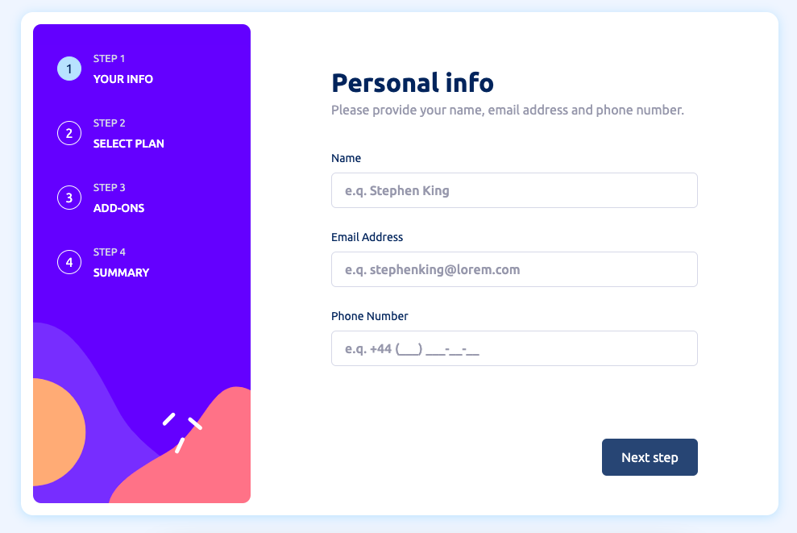

# Frontend Mentor - Multi-step form solution

This is a solution to the [Multi-step form challenge on Frontend Mentor](https://www.frontendmentor.io/challenges/multistep-form-YVAnSdqQBJ). Frontend Mentor challenges help you improve your coding skills by building realistic projects. 

## Table of contents

- [Overview](#overview)
  - [The challenge](#the-challenge)
  - [Screenshot](#screenshot)
  - [Links](#links)
- [My process](#my-process)
  - [Built with](#built-with)
- [Author](#author)
- [Acknowledgments](#acknowledgments)
- [Available Scripts](#available-scripts)

## Overview

### The challenge

Users should be able to:

- Complete each step of the sequence
- Go back to a previous step to update their selections
- See a summary of their selections on the final step and confirm their order
- View the optimal layout for the interface depending on their device's screen size
- See hover and focus states for all interactive elements on the page
- Receive form validation messages if:
  - A field has been missed
  - The email address is not formatted correctly
  - A step is submitted, but no selection has been made

### Screenshot

### Links

- Solution URL: [https://github.com/K-ost/Multi-step-form](https://github.com/K-ost/Multi-step-form)
- Live Site URL: [https://k-ost.github.io/multi-step-form/](https://k-ost.github.io/multi-step-form/)

## My process

### Built with

- Semantic HTML5 markup
- CSS custom properties
- Flexbox
- Mobile-first workflow
- [React](https://reactjs.org/) - JS library
- [Redux toolkit](https://redux-toolkit.js.org/) - State managment
- [React hook form](https://www.react-hook-form.com/) - Form validation
- [Styled Components](https://styled-components.com/) - For styles

## Author

- Website - [Kostya](https://github.com/K-ost?tab=repositories)
- Frontend Mentor - [@K-ost](https://www.frontendmentor.io/profile/K-ost)

## Acknowledgments

This is my own project I developed by myself. Of course, I know this project might have been developed without using React-router-dom and redux. But it seemed to be convenient to me.

## Available Scripts

In the project directory, you can run:

### `npm start`

Runs the app in the development mode.\
Open [http://localhost:3000](http://localhost:3000) to view it in the browser.

The page will reload if you make edits.\
You will also see any lint errors in the console.